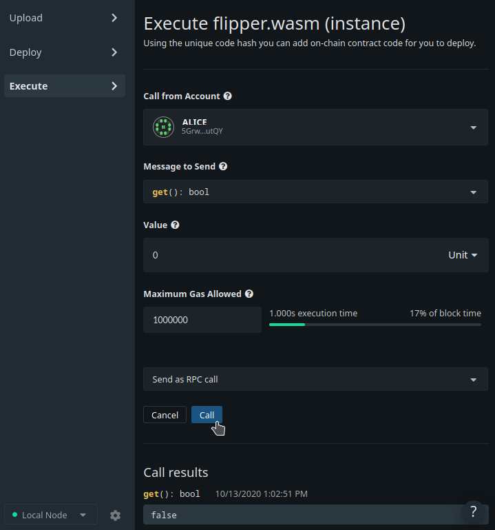

Now that your contract has been fully deployed, we can start to interact with it! Flipper only has two functions, so we will show you what it's like to play with both of them. Click the **"Execute Contract"** button on the confirmation screen that appeared after you deployed the instance of the Flipper contract in the previous step.

## get()

If you take a look back at our contract's `default()` function, we set the initial value of the Flipper contract to `false`. Let's check that this is the case.

In the **Message to Send** section, select the **"get(): bool"** message and accept the default values for the other options.

Press **"Call"** and confirm that it returns the value `false`:

> NOTE: You might be wondering: "Why did we need to specify gas when reading a value from a contract?"
>
> If you notice right above the "Call" button is a select box that allows you to "Send call as RPC call" or "Send as transaction". For a read-only request like this, we can simply use an RPC call which will _simulate_ a transaction, but not actually store anything on-chain. Thus, you will still need to specify the right amount of gas to cover your "virtual fee", but don't worry, nothing will be charged when making a call this way. :)

## flip()

So let's make the value turn `true` now!

The alternative _message to send_ we can make with the UI is `flip()`. Again, accept the default values for the other options.

You will notice that the `flip()` message defaults to a transaction call.

If the transaction was successful, we should then be able to go back to the `get()` function and see our updated storage:

Woohoo! You deployed your first smart contract!

## Moving Forward

If you are looking for a guided tutorial on how to build a more complex 
smart contract you might want to check out our [ERC-20 tutorial](https://substrate.dev/substrate-contracts-workshop/#/2/introduction).
