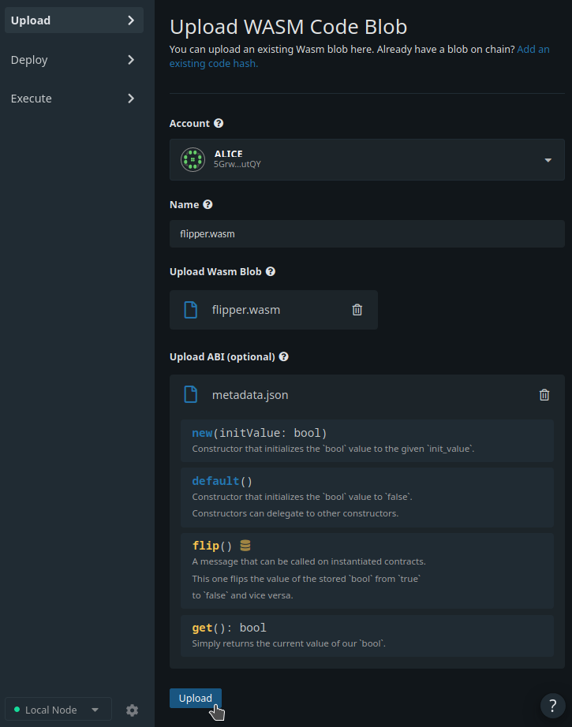
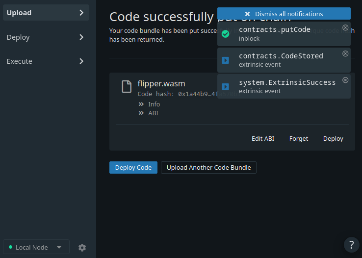
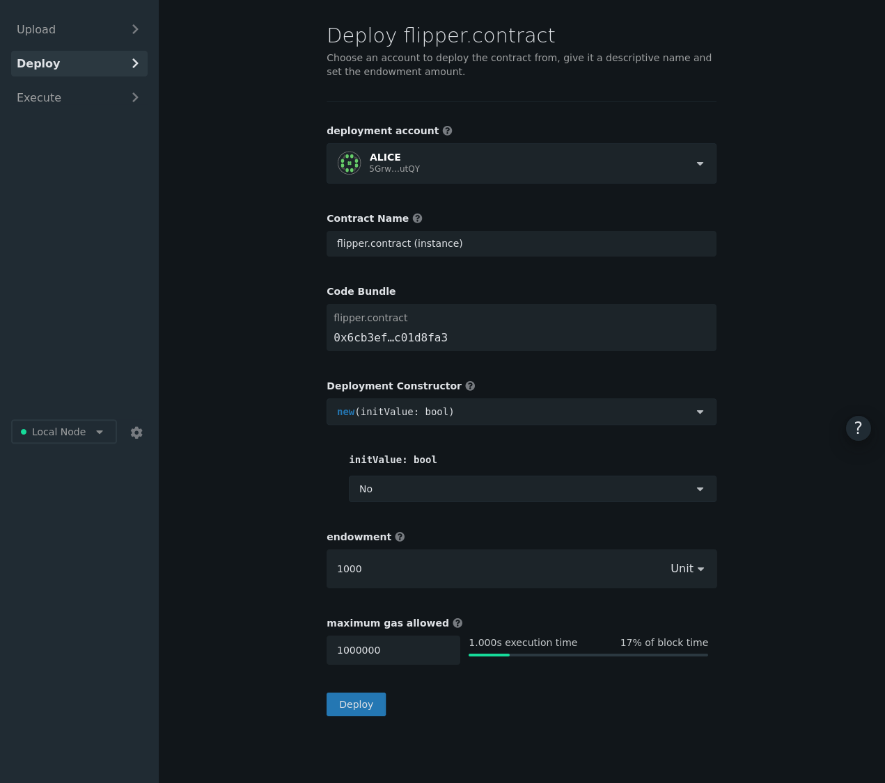
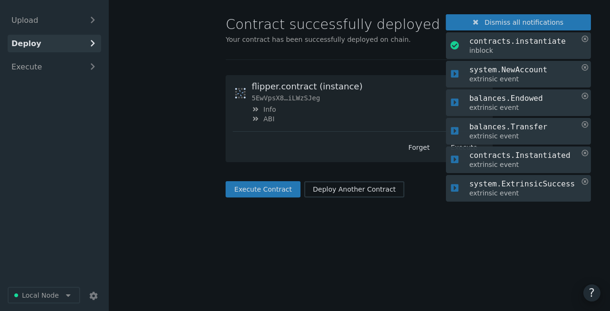

Now that we have generated the Wasm binary from our source code and started a Canvas node, we want to deploy this contract onto our Substrate blockchain.

Smart contract deployment on Substrate is a little different than on traditional smart contract blockchains.

Whereas a completely new blob of smart contract source code is deployed each time you push a contract on other platforms, Substrate opts to optimize this behavior. For example, the standard ERC20 token has been deployed to Ethereum thousands of times, sometimes only with changes to the initial configuration (through the Solidity `constructor` function). Each of these instances take up space on the blockchain equivalent to the contract source code size, even though no code was actually changed.

In Substrate, the contract deployment process is split into two halves:

1. Putting your code on the blockchain
2. Creating an instance of your contract

With this pattern, contract code like the ERC20 standard can be put on the blockchain a single time, but instantiated any number of times. No need to continually upload the same source code over and waste space on the blockchain.

## Putting Your Code on the Blockchain

Open the specially designed **Upload** section of the Canvas UI.

Use the dropdown to select a _deployment account_ with some account balance, like `Alice`. Enter a name for the contract in the input field. Provide the `flipper.contract` file as the bundled Wasm blob and metadata.

Click **Upload** and then **Sign & Submit** on the confirmation page.

This should emit a `contracts.PutCode` event. If the transaction succeeds you will get an `system.ExtrinsicSuccess` event and your WASM contract will be stored on your Substrate blockchain!

## Creating an Instance of Your Contract

Smart contracts exist as an extension of the account system on the blockchain. Thus creating an instance of this contract will create a new `AccountId` which will store any balance managed by the smart contract and allow us to interact with the contract.

After you uploaded the contract in the previous step, a confirmation screen displays the information that represents our smart contract. We now need to deploy our smart contract to create an **instance**. Press the **"Deploy Code"** button on the confirmation screen.

To instantiate our contract, accept the default options to give this contract account an _endowment_ of `1000 Units` in order to pay the storage rent and set a _maximum gas allowed_ value of `1000000`:

> **Note:** As mentioned earlier, contract creation involves creation of a new Account. As such, you must be sure to give the contract account at least the existential deposit defined by your blockchain. We also need to be able to pay the contract's rent (_`endowment`_). If we consume all of this deposit, the contract will become invalid. We can always refill the contract's balance and keep it on chain.

When you press **Deploy**, you should see a flurry of events appear including the creation of a new account (`system.NewAccount`) and the instantiation of the contract (`contracts.instantiate`):

