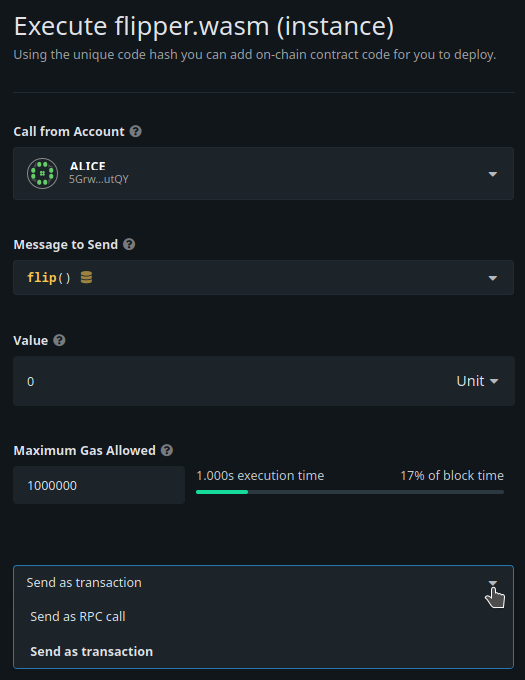

#### :heavy_exclamation_mark: ** Important notice** 
> :warning: **Canvas UI is undergoing technical difficulties and is not functional at the moment** .
> While we are working on a fix, please use https://polkadot.js.org/apps/ to deploy and interact with your contracts. Same principles apply, the UI differs slightly. 
> Make sure you are connected to the local node by selecting it from the top left menu and that you navigate to Developer/Contracts page!


Here are solutions to some of the common problems you may come across:

### Unexpected Epoch Change

There is a known issue with the Substrate block production (BABE) on a running chain. If you stop your node for too long (closing the terminal, putting your computer to sleep, etc.), you will get the following error:

```bash
ClientImport("Unexpected epoch change")
```

To solve this you will need to restart your node with: `substrate-contracts-node --dev --tmp`. At that point, you will
need to re-deploy any contracts and re-do any steps that you may have done before on your node. As
long as you keep your node running, you should face no issues.

### Old Contracts in Local Storage

**Canvas UI** uses its own local storage to track the contracts that you have deployed. This means
that if you deploy a contract using the UI, and then purge your Substrate node, you will be prompted to
reset your local storage and please do so. And then re-deploy any contracts and re-do any steps that
you may have done before on your node.

### "Send as Transaction" vs. "Send as RPC"

When interacting with contracts using the Canvas UI, you have the option to submit your call as a
transaction or as a RPC:



When you send as a transaction, it should be exactly as you expect. A transaction is submitted to
the contract, a fee is deducted from your account, and the state of your blockchain can change. In
these situations, no value is returned from your contract call, only a "Success" or "Failed"
extrinsic message along with any events it may emit.

However, there may be some calls that you want to "test", rather than actually submit a transaction,
or you may want to peek at the value that *would* be returned if you called the contract function.
For these scenarios, you submit an RPC call, which will run all of your contract logic, but not
actually submit a transaction or update the chain state. However, you will still need to specify
the right amount of gas to cover your "virtual fee". But don't worry, nothing will be charged when making a call this way. :)

### Other Issues

If you run into any other issues during this tutorial, please [report an issue](https://github.com/substrate-developer-hub/substrate-docs/issues)!
